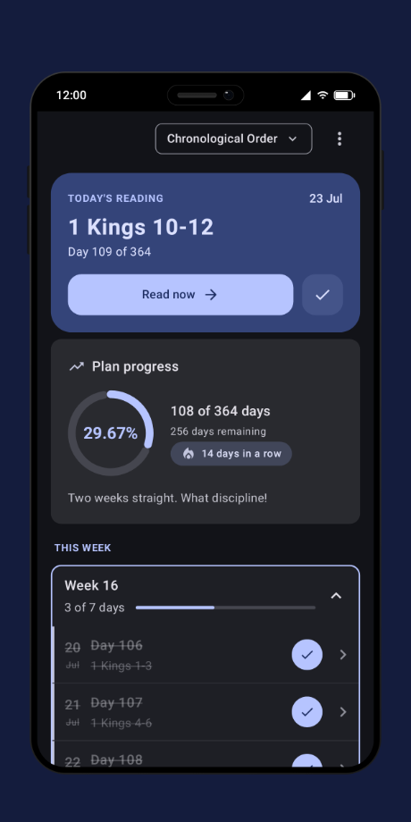
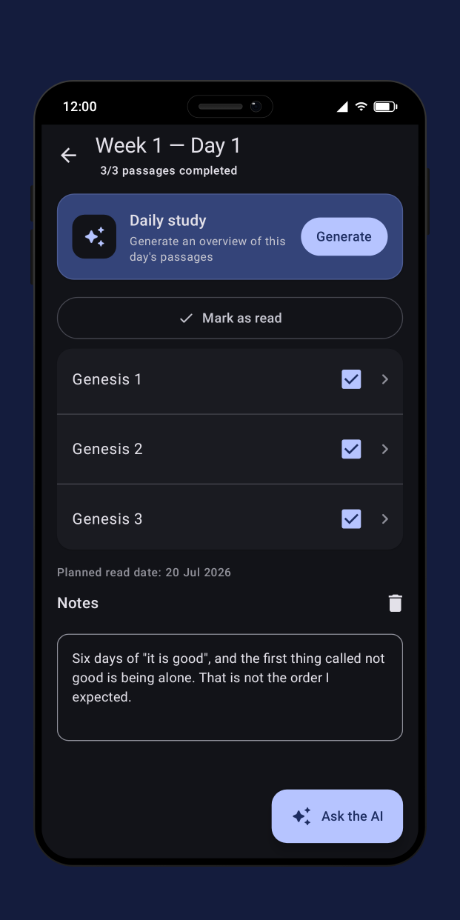
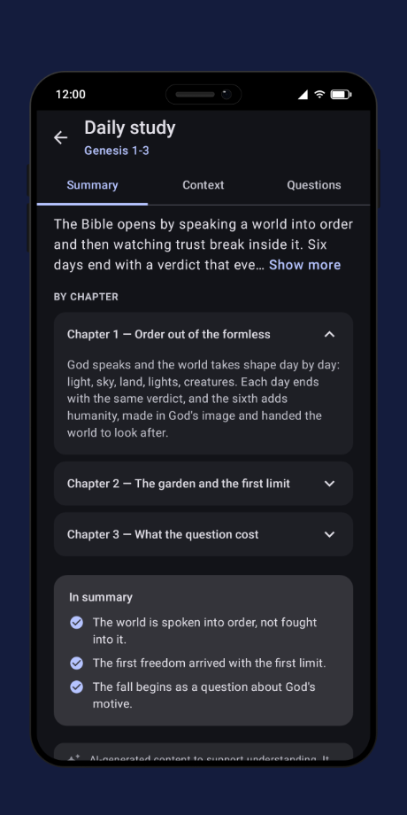
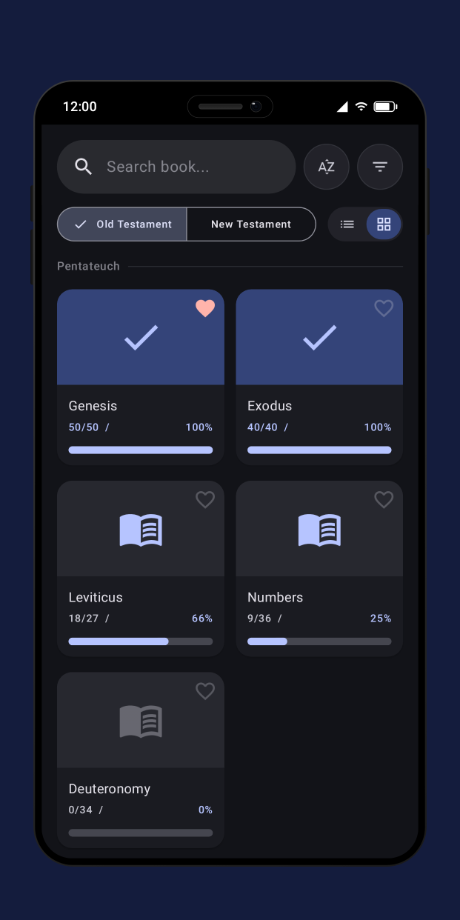
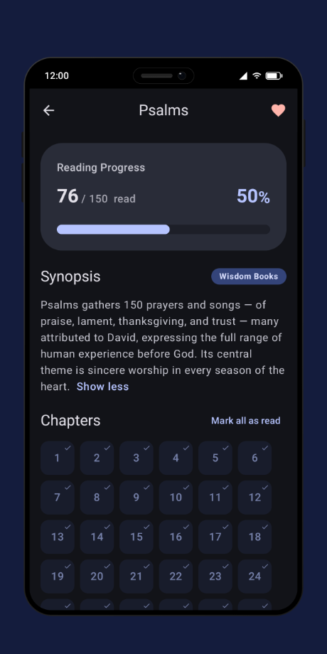
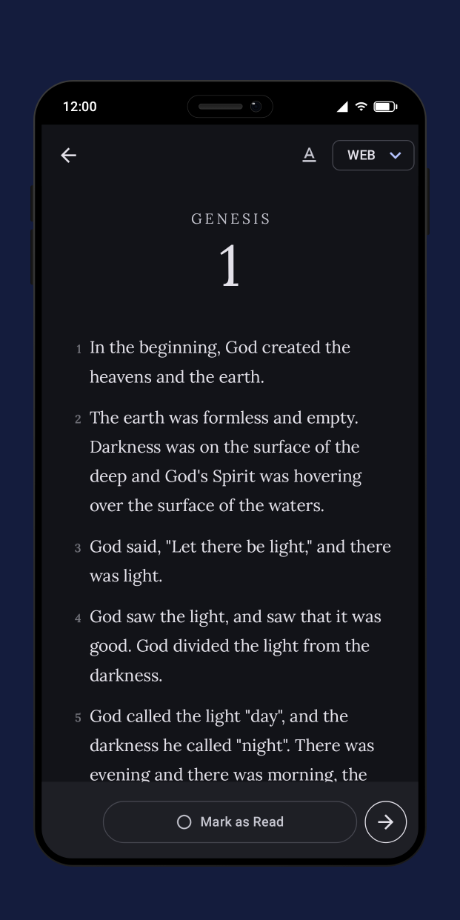
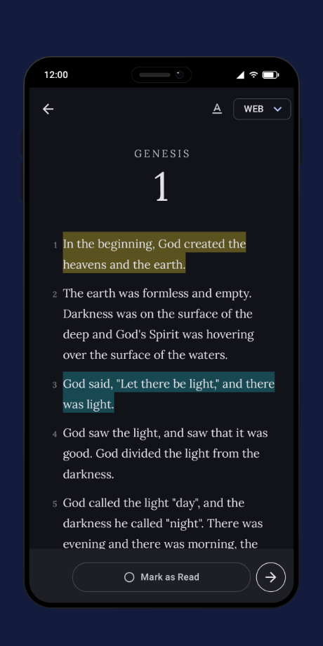
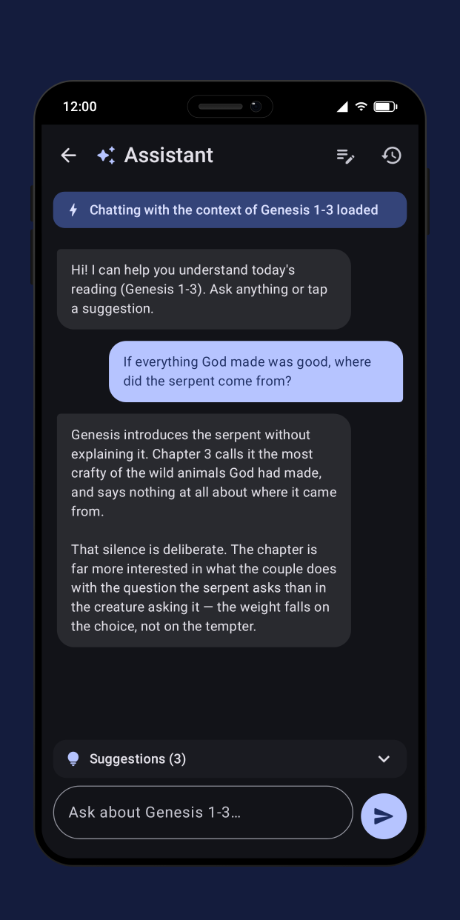
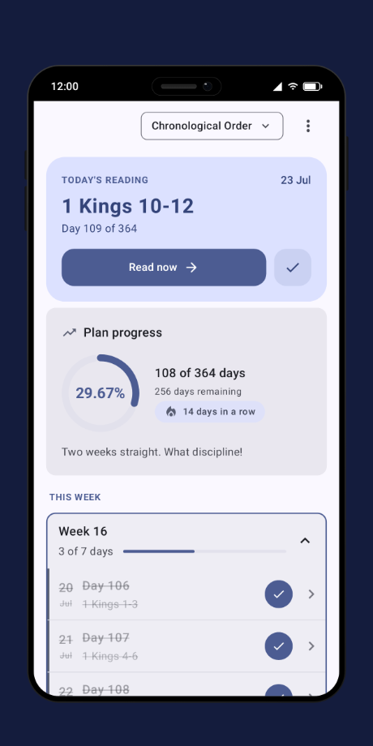
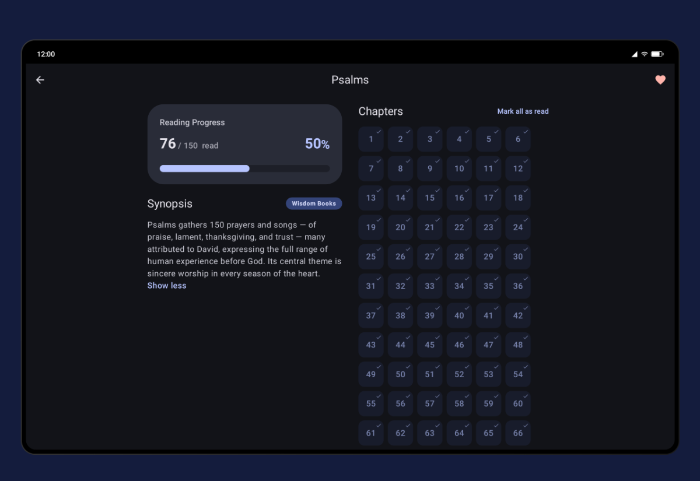

# Bible Planner

A Compose Multiplatform application for planning and tracking your Bible reading progress.
[Bible Planner](https://www.bibleplanner.app/) helps you stay organized with structured reading
plans, progress tracking, and a beautiful, customizable interface.

| Android | iOS | Web | Desktop |
| -- | -- | -- | -- |
| [Google Play Store](https://play.google.com/store/apps/details?id=com.quare.bibleplanner&hl=en) | [App Store](https://apps.apple.com/us/app/bible-planner-reading-plans/id6756151777) | Not available yet | Available just for development at the moment |

## 📱 Screenshots

Every image below is rendered from the real screens by
[`./gradlew updateReadmeScreenshots`](docs/store-listing-screenshots.md#the-readme-grid) — none of
them is captured by hand.

| The plan | The day | The study |
| :--: | :--: | :--: |
|  |  |  |

| The books | A book | The reader |
| :--: | :--: | :--: |
|  |  |  |

| Highlights | The chat | Light or dark |
| :--: | :--: | :--: |
|  |  |  |

## ✨ Features

- **A plan that keeps its place.** Chronological or book order, day by day, with the streak and the
  progress of the whole year on one card.
- **A reader built for the plan.** The day's passage opens in the app, with the font, size and
  ruler set the way you read.
- **Highlights and notes**, on the verse, synced to your account.
- **A study of every reading** — a summary, the historical context and the questions the passage
  raises — plus a chat that already knows the passage.
- **The whole Bible, tracked.** All 66 books, per-chapter progress, favourites and search.
- **Yours.** Light or dark, Material You, three languages, and everything synced across devices.

## 🖥️ One codebase, every window

The same Compose Multiplatform code lays out for the window it is given — the book screen splits
into two columns on a tablet, an iPad or the desktop app:

## 🧱 Tech stack

Kotlin Multiplatform (Android, iOS, JVM desktop) and Compose Multiplatform, with Koin for DI, Room
and DataStore for local storage, Ktor for networking, Navigation 3 for routing, Supabase for auth
and sync, RevenueCat for subscriptions, and Firebase for Crashlytics, Analytics and Remote Config.

See [Stack](docs/architecture/stack.md) and [Module structure](docs/architecture/module-structure.md)
for the whole picture.

## 🚀 Getting started

JDK 21, an IDE, and three local files a maintainer has to give you. The whole setup, and how to run
each platform, is in [Getting started](docs/getting-started.md).

## 📚 Documentation

| Document | What's in it |
|---|---|
| [Architecture guide](docs/ai_agents.md) | The index every convention hangs off — state, use cases, DI, navigation, data sources, code style. |
| [Getting started](docs/getting-started.md) | Prerequisites, local configuration, running each platform. |
| [Code quality](docs/code-quality.md) | ktlint, the custom ruleset, and what CI runs. |
| [Testing](docs/testing/README.md) | How the suites are organised and what belongs in them. |
| [Analytics](docs/analytics/README.md) | The event catalog and the rules for adding one. |
| [Design](docs/DESIGN.md) | The Material 3 design system the three platforms share. |
| [Release process](docs/release-process.md) | How a version is cut and shipped to both stores. |
| [Store listing screenshots](docs/store-listing-screenshots.md) | How these images — and the stores' — are generated. |
| [RevenueCat setup](docs/setup_revenuecat.md) | Products, entitlements and the paywall. |
| [Apple Sign-In setup](docs/setup_apple_signin.md) | The Supabase side of Sign in with Apple. |
| [Sentry setup](docs/setup_sentry.md) | Desktop crash reporting, where Crashlytics has no JVM SDK. |
| [Reset desktop data](docs/reset-desktop-data.md) | Wiping the local database and preferences while developing. |

## 📄 License

This project is licensed under the MIT License. See [LICENSE.md](./LICENSE.md) for details.
