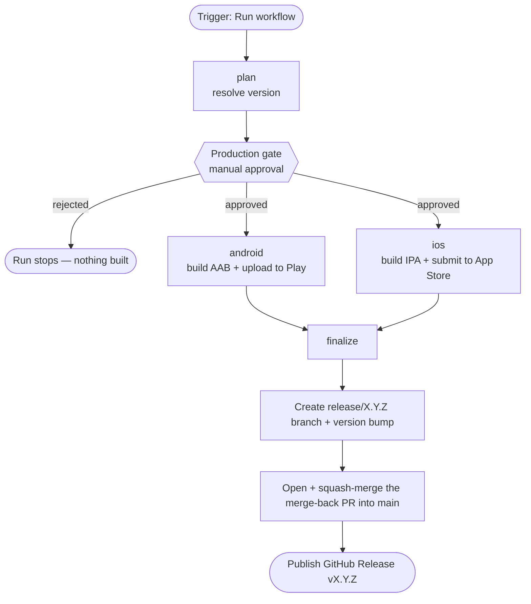
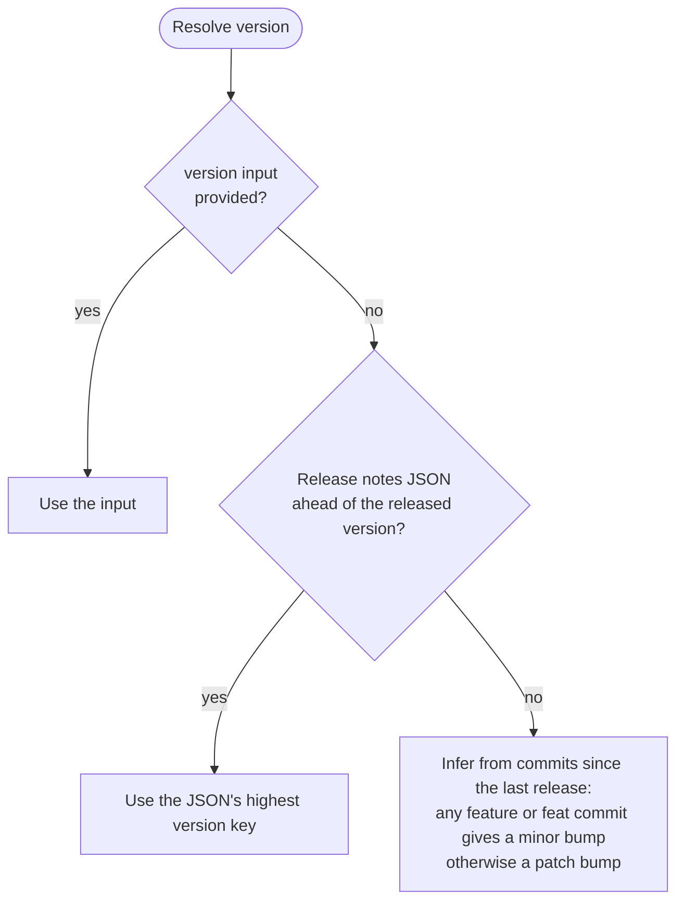

# Release Process

This document explains how Bible Planner is released to the **Google Play Store** and the
**Apple App Store** through the automated pipeline defined in
[`.github/workflows/release.yml`](../.github/workflows/release.yml).

## Overview

A release is a single manual action: you run the **release** workflow from the GitHub Actions
tab. The pipeline resolves the version, pauses for your approval, builds and uploads both apps,
and then tags the release and merges the version bump back into `main`.

Nothing is created or published before you approve the run, and all credentials live in the
`Production` GitHub Environment — only jobs that pass the approval gate can read them.

## Pipeline at a glance



| Job | Runner | Gated | What it does |
|-----|--------|-------|--------------|
| `plan` | ubuntu | no | Resolves the version and shows it in the run summary |
| `android` | ubuntu | yes | Builds the signed AAB and uploads it to Google Play |
| `ios` | macOS | yes | Builds the signed IPA, uploads it and submits it for App Store review |
| `finalize` | ubuntu | no | Branch + version bump, merge-back PR, GitHub Release |

## Triggering a release

1. Make sure the in-app release notes JSON has an entry for the upcoming version
   (see [Release notes](#release-notes-whats-new)).
2. Open **GitHub → Actions → release → Run workflow**.
3. Fill in the inputs (all optional):
   - **version** — leave blank to auto-resolve, or type an explicit `X.Y.Z`.
   - **platforms** — `both` (default), `android`, or `ios`.
   - **track** — Android Play Store track: `production` (default), `beta`, `alpha`, `internal`.
   - **complete_android_release** — `true` (default) rolls the Android release out; `false`
     uploads it to the track as a draft you release manually from the Play Console.
   - **submit_ios_for_review** — `true` (default) submits the iOS build for App Store review;
     `false` only uploads it to App Store Connect / TestFlight (use it for test runs).
4. Click **Run workflow**.
5. The `plan` job runs and prints the resolved version in the run summary. The run then pauses
   on the **Production** environment.
6. Open the run, review the planned version, and **approve** (or **reject** and start over).
7. The build, upload and finalize steps run automatically.

### Example — full production release of 1.14.0

```text
version:                  (blank — auto-resolved to 1.14.0 from the release notes JSON)
platforms:                both
track:                    production
complete_android_release: true
submit_ios_for_review:    true
```

### Example — safe test run (no production impact)

```text
version:                  (blank)
platforms:                both
track:                    internal
complete_android_release: false
submit_ios_for_review:    false
```

Android uploads to the internal testing track as a draft and iOS lands in App Store Connect /
TestFlight without being submitted for review. The `finalize` job only runs for
`platforms = both` **and** `track = production`, so a test run creates no tag, GitHub Release or
merge-back PR.

## How the version is resolved

The `plan` job runs [`scripts/suggest-version.sh`](../scripts/suggest-version.sh), which picks
the version in this order:



- The **`versionCode`** (Android) / **`CURRENT_PROJECT_VERSION`** (iOS) is always the current
  value **+ 1**.
- The release notes JSON is the preferred source: its newest key is the version the team has
  been accumulating notes for, so the version and the "What's New" come from the same place.

## Release notes ("What's New")

Release notes live in three JSON files, keyed by version:

```
feature/release_notes/src/commonMain/composeResources/files/release_notes/{en,pt,es}.json
```

```json
{
  "1.14.0": [
    "You can now change the app language from the 'More' screen.",
    "Fixed extra whitespace below the search bar."
  ]
}
```

Keep them updated during the development cycle with the `release-notes-updater` skill. At
release time the pipeline reads the entry for the version being shipped and publishes it as the
store "What's New":

- **Google Play** — written as changelog files for every listing locale (`en-US`, `pt-BR`,
  `es-419`, `es-ES`, `es-US`).
- **App Store** — the listing's locales are discovered at runtime via the App Store Connect API,
  and the notes are matched by language.

If no JSON entry exists for the version, the build still ships — the store "What's New" is just
left unchanged.

## Approval gate

The `android` and `ios` jobs target the `Production` GitHub Environment, which has **required
reviewers**. The run pauses before those jobs until a reviewer approves it. Because `plan` has
already run, the reviewer can see the resolved version in the run summary before approving.

To use a different version than the one resolved, **reject** the run and start a new one with
the `version` input set.

## After a release

Once both store uploads succeed, `finalize`:

1. Creates the `release/X.Y.Z` branch with the version bump commit (Android, iOS and Desktop —
   see [`scripts/bump-version.sh`](../scripts/bump-version.sh)).
2. Opens a `chore: merge back X.Y.Z into main` pull request and squash-merges it into `main`.
3. Publishes a **GitHub Release** `vX.Y.Z` with auto-generated notes.

## If a store rejects the build

Apple/Google review is still a human gate and can reject a build. If that happens, fix the code
and ship it as the next version — the rejected version's GitHub Release/tag can simply be
deleted. The version code is already consumed, which is fine: version codes only need to keep
increasing.

## Manual version bump (local)

To bump versions outside the pipeline (Android, iOS and Desktop at once):

```bash
./scripts/bump-version.sh 1.14.0 23
#                          │      └─ versionCode
#                          └──────── versionName
```

## Configuration reference

| Item | Value |
|------|-------|
| Workflow | `.github/workflows/release.yml` |
| Fastlane lanes | `fastlane/Fastfile` (`android release`, `ios release`) |
| iOS certificates | fastlane match — private repo `bible-planner-certs` |
| Approval gate | `Production` GitHub Environment (required reviewers) |

All secrets are stored in the `Production` environment, never committed:

`ANDROID_KEYSTORE_BASE64`, `ANDROID_KEYSTORE_PASSWORD`, `ANDROID_KEY_ALIAS`,
`ANDROID_KEY_PASSWORD`, `PLAY_STORE_SERVICE_ACCOUNT_JSON`, `GOOGLE_SERVICES_JSON`,
`GOOGLE_SERVICE_INFO_PLIST`, `APP_STORE_CONNECT_API_KEY_ID`,
`APP_STORE_CONNECT_API_ISSUER_ID`, `APP_STORE_CONNECT_API_KEY_P8`, `MATCH_PASSWORD`,
`MATCH_SSH_PRIVATE_KEY`.
