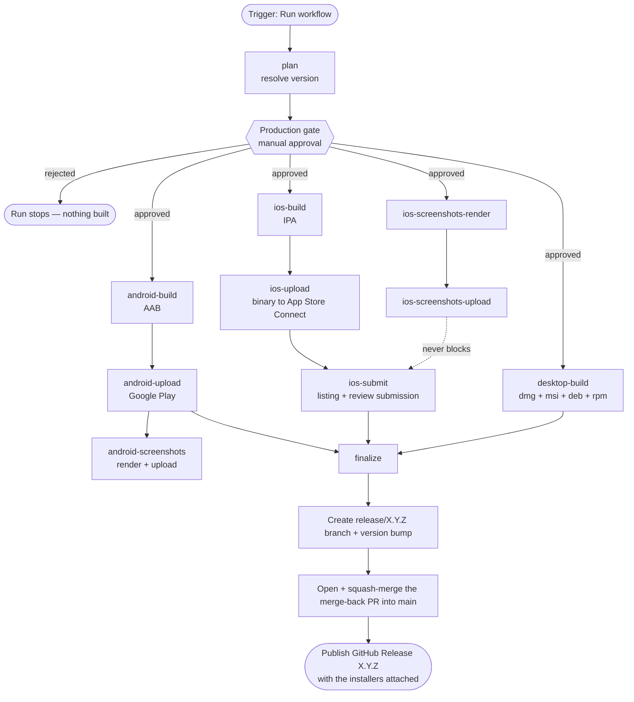
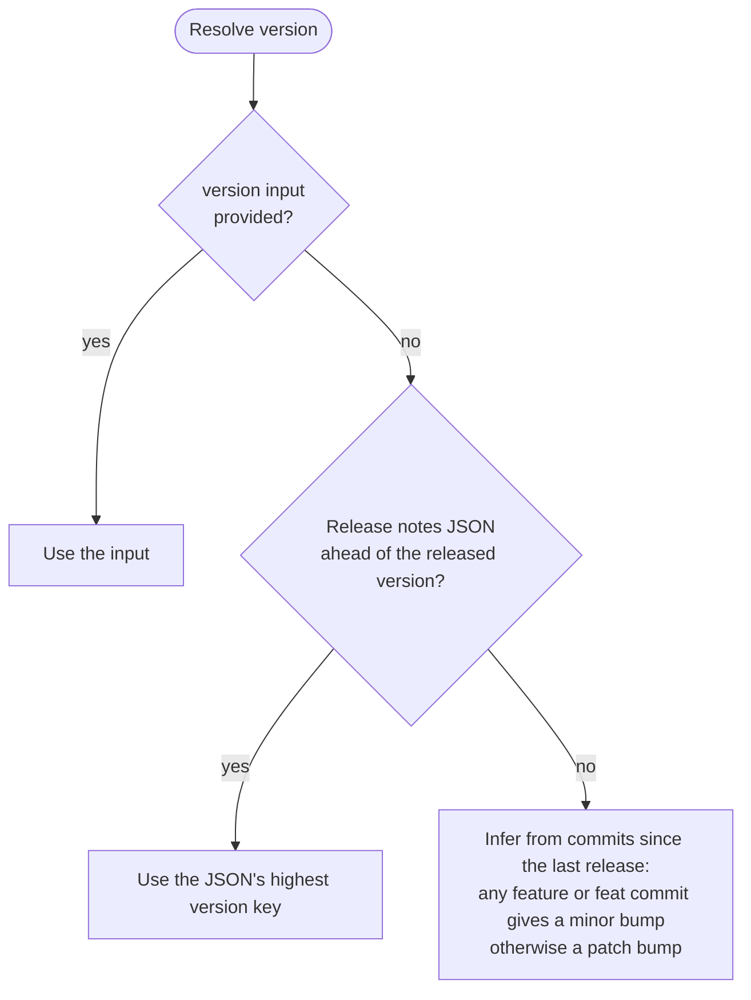

# Release Process

This document explains how Bible Planner is released to the **Google Play Store** and the
**Apple App Store** through the automated pipeline defined in
[`.github/workflows/release.yml`](../.github/workflows/release.yml).

## Overview

A release is a single manual action: you run the **release** workflow from the GitHub Actions
tab. The pipeline resolves the version, pauses for your approval, builds and uploads the mobile
apps, packages the desktop installers, and then tags the release and merges the version bump
back into `main`.

Nothing is created or published before you approve the run, and all credentials live in the
`Production` GitHub Environment — only jobs that pass the approval gate can read them.

## Pipeline at a glance


```mermaid
flowchart TD
    A([Trigger: Run workflow]) --> B[plan<br/>resolve version]
    B --> G{{Production gate<br/>manual approval}}
    G -->|rejected| X([Run stops — nothing built])
    G -->|approved| D1[android-build<br/>AAB]
    G -->|approved| E1[ios-build<br/>IPA]
    G -->|approved| S1[ios-screenshots-render]
    G -->|approved| H[desktop-build<br/>dmg + msi + deb + rpm]
    D1 --> D2[android-upload<br/>Google Play]
    D2 --> D3[android-screenshots<br/>render + upload]
    E1 --> E2[ios-upload<br/>binary to App Store Connect]
    S1 --> S2[ios-screenshots-upload]
    E2 --> E3[ios-submit<br/>listing + review submission]
    S2 -.->|never blocks| E3
    D2 --> F[finalize]
    E3 --> F
    H --> F
    F --> F1[Create release/X.Y.Z branch + version bump]
    F1 --> F2[Open + squash-merge the merge-back PR into main]
    F2 --> F3([Publish GitHub Release X.Y.Z<br/>with the installers attached])
```

| Job | Runner | Gated | What it does |
|-----|--------|-------|--------------|
| `plan` | ubuntu | no | Resolves the version and shows it in the run summary |
| `android-build` | ubuntu | yes | Builds the signed AAB and saves it as a build artifact |
| `android-upload` | ubuntu | yes | Uploads the AAB to Google Play |
| `android-screenshots` | ubuntu | yes | Calls the `store screenshots` workflow: one job renders the Play screenshots, the next uploads them |
| `ios-build` | macOS | yes | Builds the signed IPA and saves it as a build artifact |
| `ios-upload` | macOS | yes | Uploads the IPA to App Store Connect — the binary only |
| `ios-screenshots-render` | macOS | yes | Renders the App Store screenshots, next to `ios-build`, and saves them as a build artifact |
| `ios-screenshots-upload` | macOS | yes | Uploads the rendered screenshots to the editable App Store version |
| `ios-submit` | macOS | yes | Updates the App Store listing and submits the uploaded build for review |
| `desktop-build` | macOS + windows + ubuntu | yes | Builds the `.dmg`, `.msi`, `.deb` and `.rpm` installers, one runner per OS |
| `finalize` | ubuntu | no | Branch + version bump, merge-back PR, GitHub Release with the installers attached |

Desktop has no store to upload to: the installers are attached to the GitHub release by
`finalize`. They are unsigned, so macOS Gatekeeper and Windows SmartScreen warn on first launch.

## Retrying a failed run

**Re-run failed jobs** repeats whole jobs, never single steps, so every stage that can fail on
its own is a job of its own, and what one produces reaches the next as a build artifact. Retrying
picks up from the job that failed:

| What failed | What runs again | What does not |
|-------------|-----------------|---------------|
| `android-upload` | The upload | The AAB build |
| `ios-upload` | The binary upload | The IPA build |
| `ios-screenshots-upload`, or the upload job of `android-screenshots` | The screenshot upload | The render |
| `ios-submit` | The listing update and the review submission | The IPA build, the binary upload, the screenshots |

The jobs that depend on the retried one run again after it. Three of them are built for that:

- `ios-upload` looks the build up on App Store Connect first and skips the upload when it is
  already there, since App Store Connect refuses a build number it has already taken.
- `android-upload` does the same on Google Play, which refuses a versionCode it has already
  taken. When a release on the track that isn't a draft already carries the versionCode, the job
  only updates the listing copy. When the bundle is only in the Play library, it puts that bundle
  on the track with the release notes, without uploading it again. A lookup that fails falls
  back to the upload.
- `finalize` does nothing once the GitHub release is published, so a retry that comes after the
  release was tagged — a screenshot upload that had left the build unsubmitted, say — does not
  try to tag it a second time.

The signed binaries are kept as artifacts for one day and the screenshots for seven, so a retry has
to happen within that window. After it, start a new run.

`finalize` runs only when `android-upload` and `ios-submit` both succeeded. The screenshot jobs
are the exception to everything above: they never hold a release, see
[Store listing screenshots](#store-listing-screenshots).

## Triggering a release

1. Make sure the in-app release notes JSON has an entry for the upcoming version
   (see [Release notes](#release-notes-whats-new)).
2. Open **GitHub → Actions → release → Run workflow**.
3. Fill in the inputs (all optional):
   - **version** — leave blank to auto-resolve, or type an explicit `X.Y.Z`.
   - **platforms** — `all` (default), `mobile` (android + ios), `android`, `ios`, or `desktop`.
   - **track** — Android Play Store track: `production` (default), `beta`, `alpha`, `internal`.
   - **complete_android_release** — `true` (default) rolls the Android release out; `false`
     uploads it to the track as a draft you release manually from the Play Console.
   - **submit_ios_for_review** — `true` (default) submits the iOS build for App Store review;
     `false` only uploads it to App Store Connect / TestFlight (use it for test runs).
   - **prerelease** — `false` (default). `true` ships a beta that never reaches the public:
     the version is named `X.Y.Z-beta-N`, Android goes to the Play **internal** track, iOS to
     TestFlight without review, desktop is skipped and the GitHub Release is marked as a
     **pre-release**. `track` and `submit_ios_for_review` are ignored (forced to `internal` /
     off), and `platforms` must be `all` or `mobile`.

Alternatively, run `./scripts/release/release.sh` from the terminal — it asks for the same inputs
as a menu (with the same defaults) and prints the link to the dispatched run. For a full
production release on every platform with no prompts, run `./scripts/release/prod/release-prod-all.sh`;
for a mobile-only (android + ios) production release, run `./scripts/release/prod/release-prod-mobile.sh`;
for a pre-release beta with no prompts, run `./scripts/release/release-beta.sh`.
4. Click **Run workflow**.
5. The `plan` job runs and prints the resolved version in the run summary. The run then pauses
   on the **Production** environment.
6. Open the run, review the planned version, and **approve** (or **reject** and start over).
7. The build, upload and finalize steps run automatically.

### Example — full production release of 1.14.0

```text
version:                  (blank — auto-resolved to 1.14.0 from the release notes JSON)
platforms:                all
track:                    production
complete_android_release: true
submit_ios_for_review:    true
```

### Example — safe test run (no production impact)

```text
version:                  (blank)
platforms:                all
track:                    internal
complete_android_release: false
submit_ios_for_review:    false
```

Android uploads to the internal testing track as a draft and iOS lands in App Store Connect /
TestFlight without being submitted for review. The `finalize` job only runs for
`platforms = all|mobile` **and** `track = production` (or a pre-release), so a test run creates
no tag, GitHub Release or merge-back PR.

### Example — pre-release beta of 2.4.0

```text
version:                  (blank — auto-resolved, becomes 2.4.0-beta-1)
platforms:                mobile
track:                    (ignored — forced to internal)
complete_android_release: true
submit_ios_for_review:    (ignored — forced off)
prerelease:               true
```

Unlike a test run, a pre-release **does** finalize: it tags `2.4.0-beta-N`, squash-merges a
versionCode-only bump back into `main` (the `versionName` in `version.xcconfig` stays at the
last stable until the real release) and publishes a GitHub Release marked as a **pre-release**,
with no installers attached. The beta number `N` is computed automatically from the existing
`2.4.0-beta-*` tags. The `beta-N` suffix appears on the Android `versionName`, the tag and the
GitHub Release — Apple rejects suffixed version strings, so the iOS build keeps the plain
`X.Y.Z` and is distinguished in TestFlight by its build number (the `versionCode`). The store
"What's New" still comes from the plain `X.Y.Z` entry in the release notes JSON.

## How the version is resolved

The `plan` job runs [`scripts/suggest-version.sh`](../scripts/suggest-version.sh), which picks
the version in this order:


```mermaid
flowchart TD
    A([Resolve version]) --> B{version input<br/>provided?}
    B -->|yes| C[Use the input]
    B -->|no| D{Release notes JSON<br/>ahead of the released version?}
    D -->|yes| E[Use the JSON's highest version key]
    D -->|no| F[Infer from commits since the last release:<br/>any feature or feat commit gives a minor bump<br/>otherwise a patch bump]
```

- The **`versionCode`** (Android) / **`CURRENT_PROJECT_VERSION`** (iOS) is always the current
  value **+ 1** — including for pre-releases, which is why each beta merges a versionCode-only
  bump back into `main`.
- The release notes JSON is the preferred source: its newest key is the version the team has
  been accumulating notes for, so the version and the "What's New" come from the same place.
- For a pre-release, the resolved `X.Y.Z` additionally gets a `-beta-N` suffix, where `N` is
  one past the highest existing `X.Y.Z-beta-*` tag.

## Release notes ("What's New")

Release notes live in three JSON files, keyed by version and grouped into platform buckets:

```
feature/release_notes/src/commonMain/composeResources/files/release_notes/{en,pt,es}.json
```

```json
{
  "1.14.0": {
    "common": [
      "You can now change the app language from the 'More' screen."
    ],
    "android": [
      "Fixed content hidden behind the navigation bar."
    ],
    "ios": [
      "The tab bar now uses the system's own look."
    ]
  }
}
```

The buckets are `common`, `android`, `ios` and `desktop`, all optional. Every platform shows
`common` followed by its own bucket, so a platform-specific note never reaches users who can't see
the change. In the app's release notes screen, a version with nothing for the current platform is
hidden.

Keep them updated during the development cycle with the `release-notes-updater` skill.
[`scripts/check_release_notes.py`](../scripts/check_release_notes.py) runs in the `translations`
workflow and fails the PR when a bucket is unknown or empty, or when the three languages disagree
on versions, buckets or number of notes.

At release time the pipeline reads the entry for the version being shipped:

- **Google Play** — `common` + `android`, written as changelog files for every listing locale
  (`en-US`, `pt-BR`, `es-419`, `es-ES`, `es-US`).
- **App Store** — `common` + `ios`. The listing's locales are discovered at runtime via the App
  Store Connect API, and the notes are matched by language.
- **GitHub Release** — the English notes of every bucket, one section per platform
  ([`scripts/github_release_notes.py`](../scripts/github_release_notes.py)), above GitHub's
  generated list of pull requests. This is where desktop users read what changed.

If no JSON entry exists for the version, the build still ships — the store "What's New" is just
left unchanged. If the entry exists but has nothing for a store's platform, that store gets a
generic "Bug fixes and performance improvements" instead, so the iOS submission for review isn't
held back by a release whose notes are all for other platforms.

## Store listing screenshots

A production release also refreshes both stores' listing screenshots: the iOS set is rendered
while the IPA builds and uploaded to the editable version before the build is submitted for
review, and the Play set goes up through the `store screenshots` workflow once the AAB is on the
production track with a completed rollout. Every screenshot job is non-blocking, so a failure
never holds the binary: the iOS ones are listed as failed without failing the run, and
`ios-submit` goes ahead with the screenshots the version already has. The one case where it holds
the review submission back, and only that, is a locale left with no screenshots at all, which
Apple would reject — retry `ios-screenshots-upload` and `ios-submit` submits after it.
How the images are generated, edited and republished between releases is covered in
[Store listing screenshots](store-listing-screenshots.md).

## Play Data safety

The Play Data safety form is versioned too, in `fastlane/metadata/android/data_safety.csv`, the
Play Console's own export format (**App content › Data safety › Export to CSV**). After the AAB is
uploaded, `android-upload` runs `fastlane android upload_data_safety`, which posts the CSV through
the Google Play Developer API (`applications.dataSafety`) — on production releases only, never on
pre-releases or test tracks. To change the declarations, export the current CSV, edit it, and land
it here: the next production release sends it, and editing the console instead gets overwritten.

Not covered by any API, so still done by hand in the stores at release time: Play's **Ads**
declaration ("Contains ads", under App content) and the App Store's **App Privacy** labels (the
API key the pipeline uses cannot edit them).

### Foreground service declarations

Play's **Foreground service permissions** declaration (under App content) has no API either, and
every foreground service type needs its own entry. A build whose manifest adds a type, like
`mediaPlayback` in 2.12.0, fails `android-upload` with "You must let us know whether your app uses
any Foreground Service permissions". Play drops the whole upload, so the new type never reaches the
form, which only lists the types of bundles already on a release. To unlock it:

1. Download the `android-aab` artifact of the failed run and upload it under **Test and release ›
   Latest releases and bundles › Upload new version**. It goes into the library, not onto a track.
2. Create a draft release on the run's track with that bundle (**Add from library**) and save it.
   Its review step now reports the missing declaration; **Go to declaration** opens the form with
   the new type in it.
3. Pick the tasks and paste a link to a video of the feature using the service. A screen recording
   of the emulator, shared on Drive with anyone who has the link, will do. Save it.
4. **Re-run failed jobs** on the run. `android-upload` finds the bundle in the library and puts it
   on the track with the release notes, replacing the draft. It rolls the release out, or leaves
   it as a draft when the run had `complete_android_release` off. `finalize` tags the release after it.

A release finished in the Console instead is fine too. The re-run then finds it released, updates
only the listing copy, and lets `finalize` run.

## Approval gate

The `android` and `ios` jobs target the `Production` GitHub Environment, which has **required
reviewers**. The run pauses before those jobs until a reviewer approves it. Because `plan` has
already run, the reviewer can see the resolved version in the run summary before approving.

To use a different version than the one resolved, **reject** the run and start a new one with
the `version` input set.

## After a release

Once the store uploads and the desktop builds succeed, `finalize`:

1. Creates the `release/X.Y.Z` branch with the version bump commit (Android, iOS and Desktop —
   see [`scripts/bump-version.sh`](../scripts/bump-version.sh)).
2. Opens a `chore: merge back X.Y.Z into main` pull request and squash-merges it into `main`.
3. Publishes a **GitHub Release** `X.Y.Z` with auto-generated notes and the `.dmg`, `.msi`,
   `.deb` and `.rpm` installers attached as assets.

For a pre-release the branch is `release/X.Y.Z-beta-N`, the bump commit only advances the
`versionCode`, and the GitHub Release `X.Y.Z-beta-N` carries the **pre-release** badge with no
installers. Pre-releases are never marked "Latest", so anything that consumes the latest
release (like `scripts/install-latest-release-android.sh`) keeps seeing the last stable.

## If a store rejects the build

Apple/Google review is still a human gate and can reject a build. If that happens, fix the code
and ship it as the next version — the rejected version's GitHub Release/tag can simply be
deleted. The version code is already consumed, which is fine: version codes only need to keep
increasing.

## Manual version bump (local)

To bump versions outside the pipeline (Android, iOS and Desktop at once):

```bash
./scripts/bump-version.sh 1.14.0 23
#                          │      └─ versionCode
#                          └──────── versionName
```

## Configuration reference

| Item | Value |
|------|-------|
| Workflow | `.github/workflows/release.yml` |
| Fastlane lanes | `fastlane/Fastfile` (`android build`, `upload`, `upload_screenshots`, `upload_data_safety`; `ios build`, `upload`, `upload_screenshots`, `submit`) |
| iOS certificates | fastlane match — private repo `bible-planner-certs` |
| Approval gate | `Production` GitHub Environment (required reviewers) |

All secrets are stored in the `Production` environment, never committed:

`ANDROID_KEYSTORE_BASE64`, `ANDROID_KEYSTORE_PASSWORD`, `ANDROID_KEY_ALIAS`,
`ANDROID_KEY_PASSWORD`, `PLAY_STORE_SERVICE_ACCOUNT_JSON`, `GOOGLE_SERVICES_JSON`,
`GOOGLE_SERVICE_INFO_PLIST`, `APP_STORE_CONNECT_API_KEY_ID`,
`APP_STORE_CONNECT_API_ISSUER_ID`, `APP_STORE_CONNECT_API_KEY_P8`, `MATCH_PASSWORD`,
`MATCH_SSH_PRIVATE_KEY`, `LOCAL_PROPERTIES`.

`LOCAL_PROPERTIES` holds the contents of `local.properties` (minus `sdk.dir`) — the
build-time values consumed by BuildKonfig (Supabase, RevenueCat, donation addresses, the
GitHub token and the desktop analytics keys `GA_MEASUREMENT_ID` / `GA_MEASUREMENT_API_SECRET`).
The workflow writes it to `local.properties` before building, since that file
is git-ignored and would otherwise be missing on the runner.
